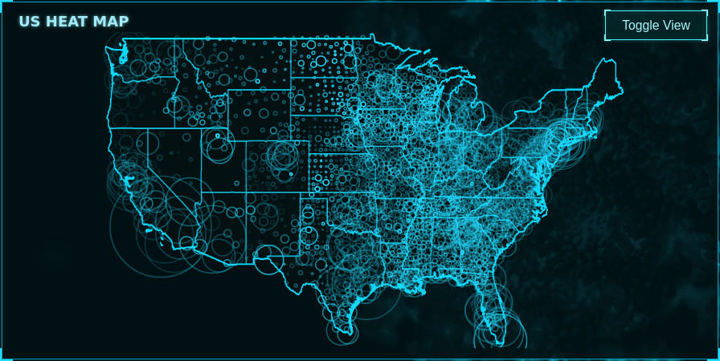
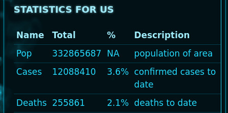
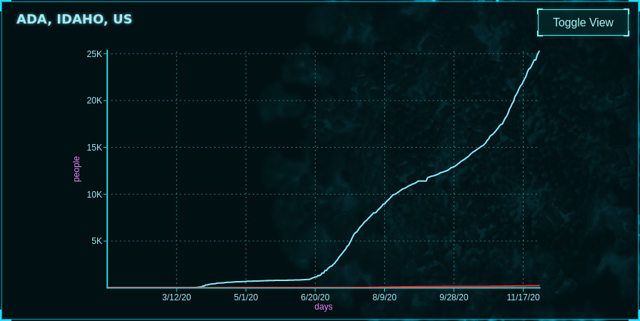
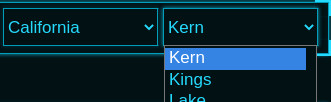

# Better CoVid Tracker Web Features
BCT runs on most modern browsers and offers two main features for viewing US CoVid-19 statistics.
* HeatMap
* TimeSeries

## HeatMap
Better Covid Tracker's Heatmap shows distribution and intensity of CoVid19 throughout the lower 48 states of the US. Each circle represents a US conty. Each circles area is proportional to the population of that county. The brightness of the circle coresponds to the percentage of population cumulatively affected by CoVid19, to date.

Curent statistics are shown in the table, to the right of HeatMap.

## TimeSeries
Better Covid Tracker's TimeSeries graph displays cases ( in cyan ) and deaths ( in magenta ), in thousands ( k ) of people, over the number of days that CoVid-19 has been tracked in the US.

Each graph shows data from a specific county. State and county may be selected from the dropdown menus.

## Next Steps
Now that you've seen the features, take a tour for yourself at the live site. Or, deploy BCT to your own server.

[&#x25B6; PLAY A LIVE DEMO](https://covid.jesse-riggs.com "Interact With BCT Live!")

[&#9992; DEPLOY TO YOUR SERVER](./deploying.html "Learn How To Deploy BCT On Your Server!")
